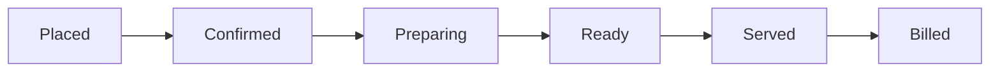

# 🍽️ Our Solution: The Smart Restaurant OS

**Team Name:** harshy1909  
**Hosted Application Link:** https://vibeathon-6-0.vercel.app/

A full-stack, real-time restaurant management platform that digitizes the in-restaurant experience end-to-end. From AI-driven customer ordering to real-time kitchen Kanban boards and automated inventory tracking, Our Solution is the ultimate "Operating System" for modern dine-in restaurants.


---

## 🚨 The Problem

Traditional restaurants rely on fragmented, manual processes that cause operational chaos:
- **Customers** suffer from slow service, paper menus without dietary context, and zero visibility into order status.
- **Kitchens (Back-of-House)** struggle with lost paper tickets, poor timing (e.g., mains arriving before starters), and untracked ingredient waste.
- **Management** lacks real-time operational insights and struggles to upsell effectively without being pushy.

## 💡 The Solution

Our Solution bridges the gap between the customer, the kitchen, and management through a **100% digitized, real-time, AI-enhanced workflow.** 

---

## ✨ Key Features

### 📱 For the Customer (Front-of-House)
* **Smart Digital Menu:** Mobile-first, interactive menu with category filtering and a responsive real-time cart.
* **Live Order Tracking:** Customers can track their order status in real-time (Placed → Confirmed → Preparing → Ready → Served) with visual progress indicators.
* **Frictionless Auth:** Secure sign-in via Email OTP and Google OAuth.
* **Background Push Notifications:** Customers receive native push notifications for order updates (e.g., when the order is confirmed or ready), even if the browser is closed or running in the background.
* **Post-Dining Feedback:** Automated rating and feedback collection once the bill is settled.

### 🍳 For the Kitchen & Staff (Back-of-House)
* **Real-Time Kanban Dashboard:** Orders instantly flow through a strict state machine, keeping the kitchen perfectly synced.
* **Staff Management Dashboard:** Comprehensive view of active orders, menu availability.
* **Table Wait-Time Alerts:** Automated visual warnings for tables exceeding average service times to ensure prompt service.
* **Push Notifications:** Staff receive push notifications for new orders and updates.
* **Seamless Billing:** Automated bill generation with tax (GST) calculation and print-ready formatting.


---

## 🛠️ Tech Stack

Our Solution is built on the bleeding edge of the modern web:

| Layer | Technology |
| --- | --- |
| **Framework** | Next.js 15 (App Router, Server Actions, React 19 features) |
| **Styling** | Tailwind CSS v4, shadcn/ui, Framer Motion for micro-interactions |
| **Database & Auth** | Supabase (PostgreSQL, Row Level Security, Auth, Magic Links) |
| **Realtime Sync** | Supabase Realtime (WebSocket multiplexing) |
| **AI Integration** | Google Gemini API (Demand forecasting, Upselling, Ops Assistant) |
| **PWA / Push** | Service Workers & Web Push API for native-like notifications |

---

## 🚀 Order State Machine

We modeled our backend on enterprise POS systems (like Toast). Orders strictly follow this flow:


* **Placed:** Triggered by the customer.
* **State Transitions:** Triggered by staff. Every transition fires a Supabase Realtime event, instantly updating the customer's phone and the kitchen dashboard without a page reload.

---

## 🏁 Getting Started (Local Setup)

### Prerequisites
- Node.js 20+
- A [Supabase](https://supabase.com) project
- A [Google Gemini API key](https://ai.google.dev)

### Installation

```bash
# 1. Clone the repo
git clone <repo-url>
cd our-solution

# 2. Install dependencies
npm install

# 3. Setup Environment Variables
cp .env.local.example .env.local
# Fill in your Supabase URL, Anon Key, and Gemini API Key in .env.local

# 4. Run the development server
npm run dev
```
Open [http://localhost:3000](http://localhost:3000) to view the app.

---

## 📈 Scalability & Architecture Notes for Judges

- **Database Sharding:** The `restaurant_id` serves as a partition key across all major tables, allowing horizontal database scaling for franchise expansions.
- **WebSocket Efficiency:** Instead of polling, we use Supabase Realtime's connection multiplexing to efficiently handle concurrent connections per restaurant.
- **Serverless Compute:** Heavy operations (like AI prompt generation and inventory deduction) run on edge/serverless functions, ensuring the UI remains buttery smooth.

---
*Built with ❤️ for the Hackathon.*
